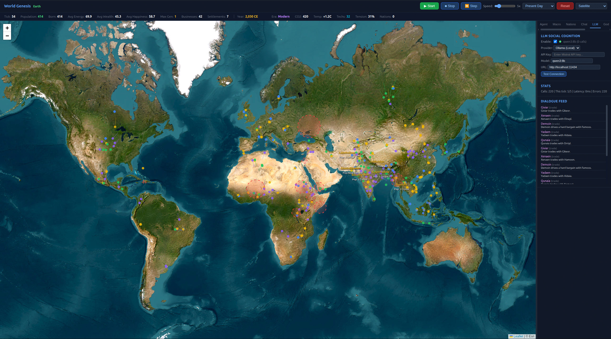

<p align="right">
  <em>A research project by <a href="https://www.geolambda.ai"><strong>GeoLambda GmbH</strong></a></em>
</p>

<p align="center">
  <sub><em>This simulation was developed primarily with Claude Code, Anthropic's agentic CLI, using both Claude Opus 4.6 and Opus 4.7. The collaboration served as a real-world stress test of the latest coding LLM through extensive prompt engineering.</em></sub>
</p>

# World Genesis: Autonomous Agent Civilization Simulator

**A physics-based, AI-driven simulation of human civilization on Planet Earth —
from the Out-of-Africa migration 70,000 years ago to climate futures beyond 2100.**

Each autonomous agent uses a JEPA world model (LeCun 2022; Maes et al. 2026) to perceive its environment and plan goal-directed movement in latent space. Goal selection follows a Maslow-style needs hierarchy modulated by personality traits — a dual-process architecture (Kahneman 2011) combining symbolic utility-AI for what-to-do with neural latent planning for how-to-move. Settlements, nations, trade networks, conflicts, and trait evolution are fully emergent on our planet's surface with real climate data.


[](LICENSE)
[](https://www.python.org/downloads/)
[](https://github.com/GeoLambdaAI/world-genesis/actions/workflows/test.yml)
[](https://www.geolambda.ai)

> **Status:** v0.2.1 — calibration release. v0.2.0 fixed six categories
> of bugs in the v0.1.0 JEPA training, climate physics, conflict modelling,
> agent lifecycle scaling, and macro/agent coupling. v0.2.1 is a same-day
> follow-up that resolved five additional coupling/timing bugs in the
> integration glue (regen-array ratchets, tech-diffusion double-credit,
> stale trade edges, paleo ice-retreat recovery, macro `dt_years` 10× rate
> mismatch) plus several UI-payload corrections that caused the right-sidebar
> dashboard to misrepresent paleo-era state. See [CHANGELOG.md](CHANGELOG.md)
> for details. The `Built primarily with Claude Code` framing in the header
> applies to the v0.1.0 generation; the v0.2.0 / v0.2.1 calibration passes
> were separate human-led reviews with LLM assistance.
> 
> **Tested on:**
> - Ubuntu 22.04 ARM, Python 3.11.
> - macOS: requires Python 3.11+ (e.g. `conda create -n worldgenesis python=3.11` or `python3.11 -m venv .venv`); Python 3.9 from miniconda base will fail due to eventlet/kqueue incompatibility. Disable AirPlay Receiver or change port from 5000 to 5001 in `app.py`.
> 
> - Windows: untested, please file issues.

<p align="center">
  <a href="static/world-genesis.jpg">
    
  </a>
  <br>
  <sub><em>World Genesis running the Present-Day scenario — autonomous agents on a real population-density-weighted distribution, with live macro state (CO₂, temperature, population), JEPA agent cognition, and emergent nations.</em></sub>
</p>

---

## Architecture Overview

```
                          +-----------------------+
                          |   Leaflet.js Frontend  |
                          |  Satellite / OSM tiles |
                          +-----------+-----------+
                                      |  WebSocket (SocketIO)
                          +-----------v-----------+
                          |   Flask Server (app.py) |
                          +-----------+-----------+
                                      |
          +---------------------------v---------------------------+
          |                    World Engine (world.py)             |
          |  Tick loop: agents -> businesses -> settlements ->    |
          |  macro ODE -> geopolitics -> resources -> UI emit     |
          +---+----------+----------+----------+----------+------+
              |          |          |          |          |
    +---------v--+  +----v----+  +-v--------+ +v-------+ +v-----------+
    | Agents     |  | Macro   |  | Geo-     | | Bridge | | History    |
    | (agents.py)|  | (macro  |  | politics | | (bridge| | (history   |
    | JEPA world |  |  .py)   |  | (.py)    | |  .py)  | |  .py)      |
    | model,     |  | 14-state|  | Nations, | | Macro  | | Paleo-     |
    | traits,    |  | ODE:    |  | alliances| | <-> Agnt| | climate,   |
    | skills,    |  | CO2,    |  | trade,   | | <-> Geo | | migration, |
    | memory     |  | temp,   |  | conflict | |        | | Diamond,   |
    +---------+--+  | SLR,    |  | (IFs)    | +--------+ | Dawkins    |
              |     | tension |  +----------+             +------------+
    +---------v--+  +---------+
    | Shared     |
    | World Model|
    | (shared_   |
    |  world_    |
    |  model.py) |
    | Batch JEPA |
    +------------+
```

---

## Table of Contents

1. [Quick Start](#quick-start)
2. [Scenarios](#scenarios)
3. [Scientific Foundations](#scientific-foundations)
4. [Module Reference](#module-reference)
5. [Data Pipeline](#data-pipeline)
6. [Performance](#performance)
7. [References](#references)

---

## Quick Start

> **For step-by-step operational guidance** — env vars, LLM setup, log analysis, troubleshooting — see [`HowTo.md`](HowTo.md).

### Requirements

- Python 3.11+
- ~17 MB disk for pre-computed Earth data

### Installation

```bash
cd interactive_simulation
pip install numpy flask flask-socketio eventlet scipy networkx shapely requests
```

### Generate Earth Data (one-time)

```bash
python generate_landmask.py        # ~10s — rasterizes Natural Earth coastlines
python generate_earth_data.py      # ~1s  — climate zones, resources, biomes
python generate_present_day_data.py # ~15s — World Bank API, NOAA, NASA (needs internet)
```

### Run

```bash
python app.py
# Open http://localhost:5000
# Select scenario → Click Start
```

---

## Scenarios

### Scenario A: 70,000 Years of Human History

Agents begin as small bands in **East Africa** (~68,000 BCE). Over thousands of
ticks they migrate through Arabia to Asia, Europe, Australia, and eventually
the Americas via the Beringia land bridge. Agriculture emerges in the Fertile
Crescent. Civilizations rise and fall. The Industrial Revolution triggers the
macro ODE system (CO2, warming, resource depletion). The simulation continues
into the future.

**Time scale**: 200 years/tick (Paleolithic) → 1 month/tick (Modern)

### Scenario B: Present Day → Future

Initializes from **real-world data** (World Bank API, NOAA, NASA GISS):
- 300 agents distributed proportional to real population density
- 140 nations from World Bank economic indicators
- 10 active conflicts with geolocation (Ukraine, Gaza, Sudan, Myanmar...)
- CO2 = 427 ppm, temperature = +1.19°C (actual 2025 values)
- Macro ODE active from tick 0

**Time scale**: 1 month/tick

---

## Scientific Foundations

The simulation integrates research from seven distinct scientific domains.
Every equation in the codebase cites its source.

### 1. JEPA World Model — Agent Cognition

Each agent perceives the world through a **Joint Embedding Predictive Architecture**
(JEPA), as proposed by Yann LeCun.

**Core papers:**
- LeCun, Y. (2022). *A Path Towards Autonomous Machine Intelligence*.
  Position paper, Meta AI. — Sections 3.1-3.3: cognitive architecture with
  world model, cost module, actor, and configurator.
- Maes, L., Le Lidec, Q., Scieur, D., LeCun, Y., & Balestriero, R. (2026).
  *LeWorldModel: Stable End-to-End Joint-Embedding Predictive Architecture
  from Pixels*. arXiv:2603.19312. — AdaLN action conditioning, SIGReg
  regularization principle, temporal path straightness metric. (Our v0.2
  SIGReg implementation is a moments-based variant — see Implementation
  Notes below.)
- Qu, H., Morel, M., McCabe, M., Bietti, A., Lanusse, F., Ho, S., & LeCun, Y. (2026).
  *Representation Learning for Spatiotemporal Physical Systems*. arXiv:2603.13227.
  — Linear probing of latent embeddings to test if physical parameters are captured.

**Implementation** (`world_model.py`, `shared_world_model.py`):

| Component | Architecture | Reference |
|-----------|-------------|-----------|
| Encoder | 3-layer MLP (obs → hidden → hidden → latent), RMSNorm + GELU | LeCun 2022, Section 3.1 |
| Predictor | MLP with **Adaptive Layer Normalization** (AdaLN) — action conditions each layer's scale and shift; zero-init scale/shift weights (DiT-style) | Maes et al. 2026, Section 3.2; Peebles & Xie 2022 |
| SIGReg (v0.2) | Differentiable moments-matching variant: skewness² + kurtosis² + variance penalty along random unit-norm projections, in the spirit of Cramer-Wold gaussianity testing | Adapted from Maes et al. 2026, Section 4 |
| CEM Planner | Cross-Entropy Method: sample action sequences, rollout in latent space, select elites, refine | LeCun 2022, Section 3.4 |
| Training | L = L\_pred + λ · SIGReg(Z), **analytic backpropagation** (hand-implemented in NumPy, gradient-checked against finite differences to <1e-10), Adam optimizer with gradient clipping at 5.0 | LeCun 2022 |

**Loss function:**

```
L = ||z_hat_{t+1} - z_{t+1}||^2 + lambda * SIGReg(Z)
```

where `z_hat_{t+1} = Predictor(Encoder(x_t), a_t)` and `z_{t+1} = Encoder(x_{t+1})`.

**Agent decision loop** (Kahneman's Dual Process Theory):
- **System 1, symbolic** (every tick): Maslow-style needs hierarchy weights
  eleven goal candidates by trait-modulated priorities (eat, heal, work, trade,
  build_business, socialize, reproduce, explore, research, govern, migrate);
  argmax selects the active goal.
- **System 1, neural** (JEPA, every PLAN_INTERVAL=3 ticks): observe → encode
  current state → encode goal-target observation → CEM plan in latent space
  → extract movement bias and intensity; cached between re-plans.
- **System 2** (LLM, optional, social actions only): trade negotiation,
  governance speech, social dialogue.

### 2. System Dynamics — Macro Model

The global state evolves via a **14-variable ODE system** inspired by the Club of Rome.

**Core references:**
- Meadows, D. H., Meadows, D. L., Randers, J., & Behrens, W. W. (1972).
  *The Limits to Growth*. Universe Books. — World3 model structure:
  population-resource-pollution feedback loops.
- Meadows, D. H., Randers, J., & Meadows, D. L. (2004).
  *Limits to Growth: The 30-Year Update*. Chelsea Green. — Calibrated depletion rates.
- Dixson-Decleve, S., Gaffney, O., Ghosh, J., Randers, J., Rockstrom, J.,
  & Stoknes, P. E. (2022). *Earth for All: A Survival Guide for Humanity*.
  New Society Publishers. — Social tension model: f(inequality, food insecurity,
  environmental degradation).
- Nordhaus, W. D. (2017). *Revisiting the social cost of carbon*.
  PNAS 114(7). — DICE model: GDP growth sector, climate damage function D = a*T^2.

**Climate sub-model** (two-layer energy balance):

```
dT/dt = (1/C) * [F(CO2) - lambda*T - gamma*(T - T_deep)]
F = 5.35 * ln(CO2/280)   [Myhre et al. 1998]
```

| Parameter | Value | Source |
|-----------|-------|--------|
| Climate sensitivity (ECS) | 3.0°C / 2xCO2 | IPCC AR6 WG1, Table 7.SM.1 |
| Ocean heat capacity C | 7.0 W·yr/m²/°C | Held et al. (2010), lower end |
| Climate feedback λ | 1.236 W/m²/°C | Calibrated so emergent ECS = F\_2x / λ = 3.00°C exactly (v0.2 fix) |
| Deep ocean coupling γ | 0.7 W/m²/°C | Gregory (2000) |
| CO2 forcing coefficient | 5.35 W/m² | Myhre et al. (1998) |
| Natural CO2 absorption | 50% of emissions (decadal mean) | Friedlingstein et al. (2024) |
| Base emission rate | 42 GtCO2/yr | Friedlingstein et al. (2024) |
| ppm per GtCO2 | 0.128 | IPCC AR6 WG1 Annex VII (= 1/2.13 GtC × 1/3.67) |

**Resource depletion** follows Hubbert-style curves (Hubbert, 1956),
not linear depletion. Technology provides a balancing loop
(S-curve growth per Romer 1990).

**Validated**: BAU scenario 2025→2100 produces 679 ppm CO2, +2.74 °C, 0.61 m
sea-level rise — sitting between IPCC AR6 SSP2-4.5 and SSP3-7.0 envelopes.
Carbon-cycle calibration verified against the Mauna Loa observed growth rate
(~2.5 ppm/yr at 2025 emissions). 9/9 IPCC validation checks plus 2 unit tests
for ECS consistency and the carbon-cycle anchor.

### 3. Geopolitics — Emergent Nation-States

Nations are **never pre-defined**. They emerge organically when agent settlements
grow large enough and merge. Interstate dynamics follow established models.

**Core references:**
- Hughes, B. B. (2019). *International Futures (IFs): Building and Using
  Global Models*. Pardee Center, University of Denver. — Conflict probability
  model with calibrated logistic regression coefficients.
- Liberal peace theory (Russett, 1993; Oneal & Russett, 1999):
  trade interdependence reduces interstate conflict probability.
- Bremer, S. A. (1992). *Dangerous Dyads: Conditions Affecting the
  Likelihood of Interstate War, 1816–1965*. Journal of Conflict Resolution
  36(2), 309–341. — Power-parity effect.
- Pettersson, T. (2024). *UCDP/PRIO Armed Conflict Dataset Codebook v24.1*.
  Uppsala Conflict Data Program. — Empirical conflict-duration anchor.
- Tinbergen, J. (1962). *Shaping the World Economy*. — Gravity model of trade.

**Conflict probability** (per nation-dyad per macro tick):

```
P(conflict) = sigmoid(
    β₀                                  # base rate (v0.2: −7.5)
    + β₁ · resource_competition         # scarce resources → conflict
    + β₂ · power_parity                 # near-peer → more likely (Bremer)
    + β₃ · (1 − trade_interdependence)  # liberal peace
    + β₄ · social_tension               # Earth4All link (v0.2: 1.5)
    + β₅ · territorial_overlap          # border proximity
    − β₆ · shared_alliances             # mutual allies → peace
    − β₇ · diplomatic_history           # positive history
)
```

Active-conflict intensity decays at 0.80/tick (~2.6-year half-life at the
default 10-month macro tick), consistent with the UCDP/PRIO median armed
conflict duration of ~3 years (Pettersson 2024).

**Calibration (v0.2)**: tuned against UCDP-style active-conflict prevalence
in a 5-nation neighbour cluster: ~10–25% / 30–50% / 50–80% prevalence at
low / mid / high social tension. v0.1 produced ~99% / 100% / 100% prevalence
because the previous decay (0.95) gave an effective conflict lifetime of
~38 years; the v0.2 calibration is a coupled re-tuning of decay, lifetime
cap, base rate, and tension coefficient. Distance calculations use haversine
(degree-equivalents) to preserve threshold semantics while correcting the
polar distortion of euclidean lat/lng.

### 4. Earth System — Planet's surface

The simulation runs on our planet's surface derived from multiple datasets.

**Data sources:**
- Natural Earth (naturalearthdata.com) — 110m land polygons, rivers, lakes.
  Rasterized to 0.25° land mask (720x1440) via Shapely point-in-polygon.
- Climate zones classified via **Whittaker biome diagram** (Whittaker 1975):
  temperature x precipitation → 12 biome types.

**Climate model components** (in `generate_earth_data.py`):

| Layer | Method | References |
|-------|--------|-----------|
| Temperature | Latitude + elevation lapse rate (-6.5°C/km) + continentality + ocean currents (Gulf Stream, Kuroshio, Humboldt, Benguela) | Hartmann (2016) *Global Physical Climatology*; Peixoto & Oort (1992) |
| Precipitation | ITCZ + Hadley cell subsidence + mid-latitude storm tracks + monsoon regions + orographic effects | Schneider et al. (2014); Hoskins & Valdes (1990); Roe (2005) |
| Soil fertility | FAO GAEZ methodology: biome + precipitation + temperature + known breadbaskets | Licker et al. (2010); Mueller et al. (2012); Schlenker & Roberts (2009) |
| Mineral deposits | Tectonic/orogenic belts + known provinces | USGS; Marshak (2019); Arndt et al. (2017); Sillitoe (2010) |
| Freshwater | Precipitation + Natural Earth rivers/lakes + known aquifer regions | Doll et al. (2003); Vorosmarty et al. (2010); Schewe et al. (2014) |
| Fossil fuels | Known sedimentary basin locations | USGS World Petroleum Assessment; BGR (2019) |

### 5. Paleoclimate — Ice Ages

The historical scenario models 70,000 years of climate oscillation.

**Data sources:**
- EPICA Community Members (2004). Eight glacial cycles from an Antarctic ice core.
  *Nature* 429, 623-628. — CO2 record for 800 kyr.
- Petit, J. R., et al. (1999). Climate and atmospheric history from the Vostok
  ice core. *Nature* 399, 429-436. — Temperature record for 420 kyr.
- Jouzel, J., et al. (2007). Orbital and millennial Antarctic climate variability
  over the past 800,000 years. *Science* 317, 793-796.
- Marcott, S. A., et al. (2013). A reconstruction of regional and global temperature
  for the past 11,300 years. *Science* 339, 1198-1201.
- Spratt, R. M., & Lisiecki, L. E. (2016). A Late Pleistocene sea level stack.
  *Climate of the Past* 12, 1079-1092.
- Clark, P. U., et al. (2009). The Last Glacial Maximum. *Science* 325, 710-714.
  — LGM ice sheet reconstructions.
- Stringer, C. (2012). *The Origin of Our Species*. Penguin. — Anatomically
  modern human dispersal timeline (Out of Africa, ~70 kya); informs Scenario A
  initial conditions.

**Key events modeled:**

| Event | Year (BP) | CO2 (ppm) | Temp (°C) | Sea Level (m) |
|-------|----------|-----------|-----------|---------------|
| Out of Africa | 70,000 | 200 | -6.0 | -80 |
| Last Glacial Maximum | 21,000 | 185 | -8.0 | -130 |
| Younger Dryas | 12,000 | 235 | -5.0 | -65 |
| Holocene Optimum | 6,000 | 270 | +0.5 | -5 |
| Pre-industrial | 200 | 280 | -0.3 | 0 |

### 6. Geographic Determinism — Diamond's Thesis

Agents experience different agricultural potential, disease resistance,
and technology diffusion rates based on their geographic location.

**Core reference:**
- Diamond, J. (1997). *Guns, Germs, and Steel: The Fates of Human Societies*.
  W. W. Norton.

**Implementation** (`history.py: GeographicAdvantage`):

| Factor | Eurasia | Africa | Americas | Source |
|--------|---------|--------|----------|--------|
| Continental axis multiplier | 1.5x (E-W) | 0.7x (N-S) | 0.5-0.6x (N-S) | Diamond Ch. 10 |
| Domesticable large mammals | 4 (sheep, goat, cattle, pig) | 0 | 1 (llama) | Diamond Ch. 9 |
| Founder crops | 8 (wheat, barley, lentils...) | 3 (sorghum, millet, cowpea) | 3 (maize, squash, beans) | Diamond Ch. 8 |
| Disease resistance (from animal proximity) | High (zoonotic exposure) | Low | Very low | Diamond Ch. 11 |

Agricultural origins: Fertile Crescent (11,500 BP), Yellow River (10,000 BP),
Yangtze (9,000 BP), Mesoamerica (9,000 BP), Andes (8,000 BP).
Diffusion modeled at ~1 km/year along latitude, slower across climate barriers.

### 7. Evolution — Agent Adaptation

Over many generations, agent populations accumulate adaptations to local
environments (cold tolerance, altitude adaptation, disease resistance).

**Core reference:**
- Dawkins, R. (2009). *The Greatest Show on Earth: The Evidence for Evolution*.
  Transworld Publishers.

**Implementation**: Trait inheritance via crossover + mutation (mutation rate 15%).
Environmental selection pressure: agents better adapted to local temperature,
altitude, and disease environment have higher survival and reproduction rates.

---

## Module Reference

### Core Simulation

| Module | Lines | Purpose |
|--------|-------|---------|
| `agents.py` | 1,208 | Autonomous agents: JEPA cognition, physics, traits, skills, memory, social actions |
| `world.py` | 1,079 | World engine: tick loop, resources, businesses, settlements, scenario dispatch, era-aware UI summaries |
| `world_model.py` | 701 | JEPA implementation: encoder, predictor (AdaLN), SIGReg, CEM planner, deterministic batch sampling |
| `shared_world_model.py` | 229 | Single shared JEPA for all agents with batch encode/plan |
| `macro.py` | 512 | 14-state ODE: climate, resources, pollution, socioeconomics |
| `geopolitics.py` | 705 | Emergent nations, alliances, trade (gravity model), conflict (IFs) |
| `bridge.py` | 456 | Bidirectional coupling: agents <-> macro <-> geopolitics; per-cell regen baselines |
| `history.py` | 849 | 70,000-year timeline: paleoclimate, migration, Diamond, Dawkins |

### Extensions

| Module | Lines | Purpose |
|--------|-------|---------|
| `llm_module.py` | 713 | LLM social cognition (Ollama/OpenAI): trade negotiation, governance speech, social dialogue |
| `god_mode.py` | 450 | Interventional experiments: whisper, commandment, drought, plague, climate nudge |
| `scenarios.py` | 334 | Scenario A (historical) and B (present-day) configuration |
| `earth.py` | 478 | Real geography: Natural Earth land mask, Whittaker biomes, resource lookup |

### Data Generation (run once)

| Script | Purpose |
|--------|---------|
| `generate_landmask.py` | Rasterize Natural Earth 110m polygons to 0.25° land mask |
| `generate_earth_data.py` | Compute 9 Earth system grids at 0.5° (temp, precip, biome, fertility, minerals, freshwater, fossil) |
| `generate_present_day_data.py` | Fetch World Bank API + NOAA + NASA data for Scenario B |

### Performance Building Blocks

| Module | Purpose |
|--------|---------|
| `agent_state.py` | Structure-of-Arrays storage + cKDTree — benchmarked at 173 tps (2000 agents) |

### Tests

| Test | Validates | Count |
|------|-----------|-------|
| `test_macro.py` | BAU 2025–2100 vs. IPCC AR6 SSP2-4.5/SSP3-7.0 envelope; carbon-cycle vs. Mauna Loa decadal mean; ECS-consistency unit test | 9 + 2 |
| `test_world_model.py` | JEPA training: prediction-loss reduction, action-conditioning, anti-collapse, linear probe R², CEM planner output validity | 5 |
| `test_world_model_gradcheck.py` | Backward implementations (linear, GELU, RMSNorm, AdaLN, SIGReg) verified against finite-difference gradients to <1e-10 | 5 |
| `test_shared_world_model.py` | Single vs. batch equivalence (max diff 1e-15), per-agent vs. plan_batch identity, edge cases | 6 |
| `test_agents_lifecycle.py` | Era-aware lifecycle thresholds across 4 eras, modern drift bounds, paleolithic 1-tick floor | 7 |
| `test_geopolitics.py` | Haversine correctness, conflict monotonicity, 5-nation BAU prevalence calibration, summit-cadence independence | 5 |
| `test_world.py` | Haversine threshold semantics, snapshot iteration safety | 4 |
| `test_bridge.py` | Behavioural identity of optimised lookups (410-agent run, 0 diffs), 6.2× hot-path speedup, edge cases | 6 |
| `test_llm_module.py` | Fallback mode, JSON parsing, rate limiting | 9 |
| `test_agent_state.py` | SoA operations, KDTree, batch metabolism + benchmarks | 4 |

---

## Data Pipeline

### Pre-computed Data Files (in `data/`)

| File | Resolution | Source | Size |
|------|-----------|--------|------|
| `landmask.npy` | 0.25° (720x1440) | Natural Earth 110m + Shapely | 1.0 MB |
| `earth_terrain.npy` | 0.5° (360x720) | Whittaker biome diagram | 253 KB |
| `earth_temperature.npy` | 0.5° | Latitude + lapse rate + ocean currents | 2.0 MB |
| `earth_precipitation.npy` | 0.5° | ITCZ + Hadley + monsoon + orographic | 2.0 MB |
| `earth_biome.npy` | 0.5° | Whittaker: temp x precip -> 12 biomes | 253 KB |
| `earth_fertility.npy` | 0.5° | FAO GAEZ-inspired + breadbaskets | 2.0 MB |
| `earth_minerals.npy` | 0.5° | USGS provinces + tectonic belts | 2.0 MB |
| `earth_freshwater.npy` | 0.5° | Precipitation + rivers + aquifers | 2.0 MB |
| `earth_fossil_fuels.npy` | 0.5° | USGS petroleum basins | 2.0 MB |
| `ne_110m_land.geojson` | 110m | Natural Earth (public domain) | 138 KB |
| `ne_110m_rivers.geojson` | 110m | Natural Earth | 38 KB |
| `ne_110m_lakes.geojson` | 110m | Natural Earth | 37 KB |
| `present_day_*.json/npy` | 2° / country | World Bank API + NOAA + NASA | ~5 MB |

---

## Performance

### Current Benchmarks (ARM64, Python 3.11, NumPy 2.4)

| Agents | ms/tick | tps | Scenario |
|--------|---------|-----|----------|
| 25 | 28 | 35.7 | Historical (Out of Africa) |
| 37 | 39 | 25.7 | Historical (after 200 ticks) |
| 300 | 328 | 3.0 | Present Day |

### Optimizations Applied

1. **Shared JEPA World Model** — 1 model for N agents (not N copies)
2. **Tick-skipping** — CEM plan every 3 ticks, cached behavior between
3. **cKDTree** — O(log N) spatial queries (was O(N) hash grid)

### Future SoA Building Blocks (benchmarked, not yet integrated)

| Component | 2000 agents | Source |
|-----------|-------------|--------|
| Physics + spatial | 5.8 ms | `agent_state.py` |
| JEPA encode + plan | 294 ms | `shared_world_model.py` |
| **Total (projected)** | **~300 ms (3.3 tps)** | |

---

## Implementation Notes

### v0.2 calibration pass

The v0.1.0 release was generated primarily with Claude Code in roughly two
weeks. A subsequent domain-review pass identified six categories of bugs
that affected scientific correctness without breaking the runtime:

1. **JEPA training did not actually train.** v0.1 estimated gradients with
   3 random search directions per weight matrix. For an encoder layer with
   16 384 parameters this gave an effective signal-to-noise ratio of ~2 ×
   10⁻⁴, so the prediction loss decreased only on the bias terms and the
   AdaLN action-conditioning weights were never updated at all. v0.2
   replaces this with hand-written analytic backpropagation in pure NumPy,
   verified against finite-difference gradients to <1e-10 relative error.
   On a synthetic toy problem with hidden physical parameters, prediction
   loss now decreases 103× and a linear probe recovers the hidden physics
   with R² = 0.98.
2. **Carbon-cycle unit conversion was off by a factor of 3.67** because
   the v0.1 code applied a GtCO₂→GtC division and then multiplied by a
   ppm/GtCO₂ constant, double-converting. The model produced ~0.8 ppm/yr
   vs. the Mauna Loa observed 2.5 ppm/yr. v0.2 fixes the conversion and
   verifies against NOAA GML decadal mean.
3. **Climate sensitivity was inconsistent** — the declared 3.0 °C ECS
   constant was unused by the ODE; emergent ECS was 3.37 °C. v0.2
   calibrates `λ` so the emergent value matches the declaration exactly.
4. **Conflict prevalence saturated at ~99%** in a 5-nation BAU run because
   conflicts decayed too slowly (38-year effective lifetime vs. UCDP
   median ~3 years). v0.2 re-calibrates decay, lifetime cap, and logit
   coefficients against UCDP prevalence targets.
5. **Lifecycle thresholds were not era-scaled.** Hardcoded `age > 40 ticks`
   reproduction threshold meant agents reproduced at 3.3 years in Modern
   era and never reached reproductive age in Paleolithic era. v0.2
   parameterises in real-world years with runtime conversion.
6. **The macro/agent coupling layer had quartisch lookups in its hot
   path**, costing ~50 ms/tick at 300 agents. v0.2 reduces to linear
   complexity (~8 ms/tick).

We document this honestly because we think the conclusion is interesting:
**LLM-generated code can produce scientifically-flavoured architectures
faster than humans can write them, but the physical and empirical
calibration requires domain expertise that LLMs (at least currently)
do not reliably substitute for.** Every fix in this list required a
domain-grounded judgment call that the original generation pass got
wrong despite confident-sounding code comments. The full v0.2 calibration
pass is documented in [CHANGELOG.md](CHANGELOG.md).

### v0.2.1 follow-up review

A same-day follow-up review pass on v0.2.0 surfaced five additional bugs
in the *integration glue* between the (now correctly calibrated) scientific
modules and the simulation loop, plus several UI-payload issues. The
themes are different from v0.2.0: where v0.2.0 was about scientific
constants and equation correctness, v0.2.1 is about coupling, timing, and
presentation correctness. The main entries:

1. **Regen-array ratchets in `bridge.py`** — `water_regen` and
   `minerals_regen` were multiplied by macro factors each tick with no
   baseline reset, underflowing to zero independently of macro state.
   `food_regen` had a related but distinct bug: a two-factor terrain
   approximation (plains vs. all-else) that silently inflated mountain,
   desert, and tundra regen by 5×, 10×, 3.3× relative to the five-factor
   `ResourceMap.initialize_from_terrain`.
2. **Tech diffusion double-credit in `geopolitics.py`** — `_diffuse_technology`
   iterated `trade_graph.edges()` on a `DiGraph` carrying both directions
   of every dyad, so each tick credited the lower-tech nation twice.
3. **Stale phantom trade edges** — when a dyad's volume fell below the
   retention threshold, the previous tick's edge persisted with its old
   weight, feeding phantom values into liberal-peace, alliance-affinity,
   and tech-diffusion calculations.
4. **Paleo `_apply_ice_age_effects` ratchet + ice-retreat recovery** —
   `food_regen *= cold_factor` compounded across tens of thousands of
   paleo ticks, and cells once covered by ice never recovered productivity
   when the ice retreated, inconsistent with the post-LGM recolonisation
   record. Fixed via per-cell baselines and a `_was_iced` transition flag.
5. **Macro `dt_years` 10× rate mismatch** — `MacroModel(dt_years = 1/12)`
   was instantiated for the per-tick calibration test, but `world.step`
   invokes macro every `macro_update_interval = 10` world ticks. The ODE
   therefore integrated only one month per ten sim months, running at
   one-tenth of the calibrated rate. Fixed by setting
   `dt_years = macro_update_interval / 12`. The standalone `test_macro.py`
   path is unaffected.

Plus several frontend issues: top-header / sidebar climate sources
diverged in modern era; the right-sidebar Macro panel showed frozen 2025
values across the entire 70 000-yr history view; temperature was rendered
as `+${value}` (yielding `+-5.13 °C` in paleo); sea-level always in cm
(yielding `-13 000 cm` for LGM); chart lines crossed through their own
`Max:` labels at peak values. v0.2.1 introduces an era-aware payload
helper, paleodemographic population from McEvedy & Jones (1978) /
Biraben (2003) / HYDE 3.1 (Klein Goldewijk et al. 2010) for the paleo
panel, and small format helpers (`fmtSigned`, `fmtSeaLevel`).

The pattern echoes v0.2.0: even after a calibration pass that fixed the
"science layer", a second pass at the *coupling* and *presentation*
layers still found real bugs that affect what a reader of the simulation
output would see. We document this not to claim every bug has now been
found — it almost certainly hasn't — but to be honest about the cost of
auditing LLM-generated code.

### Calibration philosophy

Where multiple plausible parameter sets exist, we anchor against
observation rather than to round-number defaults:

- Carbon cycle to Mauna Loa decadal mean (NOAA GML 2014–2024).
- Climate physics to IPCC AR6 SSP-envelope projections and Held et al.
  two-layer energy balance.
- Conflict to UCDP/PRIO prevalence in regional clusters (the equivalent
  of "all 5 nations are neighbours on one continent").
- Agent lifecycle to anthropological / demographic ranges
  (15-year reproduction, 80-year lifespan, 60-year senescence onset).

Every calibration choice is verified by a test that would catch a
regression from a future refactor.

---

## References

### Machine Learning & AI Architecture

1. LeCun, Y. (2022). A Path Towards Autonomous Machine Intelligence. *Meta AI Position Paper*.
2. Maes, L., Le Lidec, Q., Scieur, D., LeCun, Y., & Balestriero, R. (2026). LeWorldModel: Stable End-to-End Joint-Embedding Predictive Architecture from Pixels. *arXiv:2603.19312*.
3. Qu, H., Morel, M., McCabe, M., Bietti, A., Lanusse, F., Ho, S., & LeCun, Y. (2026). Representation Learning for Spatiotemporal Physical Systems. *arXiv:2603.13227*.
4. Kahneman, D. (2011). *Thinking, Fast and Slow*. Farrar, Straus and Giroux.

### Climate Science

5. IPCC (2021). *Climate Change 2021: The Physical Science Basis* (AR6 WG1). Cambridge University Press.
6. Myhre, G., et al. (1998). New estimates of radiative forcing due to well mixed greenhouse gases. *Geophysical Research Letters* 25(14), 2715-2718.
7. Held, I. M., et al. (2010). Probing the fast and slow components of global warming. *Journal of Climate* 23(9), 2418-2427.
8. Gregory, J. M. (2000). Vertical heat transports in the ocean and their effect on time-dependent climate change. *Climate Dynamics* 16, 501-515.
9. Friedlingstein, P., et al. (2024). Global Carbon Budget 2024. *Earth System Science Data*.

### Paleoclimate & Earth History

10. EPICA Community Members (2004). Eight glacial cycles from an Antarctic ice core. *Nature* 429, 623-628.
11. Petit, J. R., et al. (1999). Climate and atmospheric history from the Vostok ice core. *Nature* 399, 429-436.
12. Lüthi, D., et al. (2008). High-resolution carbon dioxide concentration record 650 000–800 000 years before present. *Nature* 453, 379-382.
13. Jouzel, J., et al. (2007). Orbital and millennial Antarctic climate variability. *Science* 317, 793-796.
14. Marcott, S. A., et al. (2013). A reconstruction of regional and global temperature for the past 11,300 years. *Science* 339, 1198-1201.
15. Spratt, R. M., & Lisiecki, L. E. (2016). A Late Pleistocene sea level stack. *Climate of the Past* 12, 1079-1092.
16. Clark, P. U., et al. (2009). The Last Glacial Maximum. *Science* 325, 710-714.
17. Adams, J. M., & Faure, H. (1998). A new estimate of changing carbon storage on land since the last glacial maximum. *Global and Planetary Change* 16-17, 3-24.
18. Crowley, T. J., & Baum, S. K. (1997). Effect of vegetation on an ice-age climate model simulation. *Journal of Geophysical Research* 102, 16463-16480.

### Paleodemography (paleo-era population display)

19. McEvedy, C., & Jones, R. (1978). *Atlas of World Population History*. Penguin.
20. Biraben, J.-N. (2003). An essay concerning mankind's evolution. *Population & Societies* 394, 1-4.
21. Klein Goldewijk, K., Beusen, A., van Drecht, G., & de Vos, M. (2010). HYDE 3.1: Long-term dynamic modelling of global population and built-up area. *The Holocene* 20, 565-573.

### System Dynamics & Economics

22. Meadows, D. H., et al. (1972). *The Limits to Growth*. Universe Books.
23. Meadows, D. H., Randers, J., & Meadows, D. L. (2004). *Limits to Growth: The 30-Year Update*. Chelsea Green.
24. Dixson-Decleve, S., Gaffney, O., Ghosh, J., Randers, J., Rockstrom, J., & Stoknes, P. E. (2022). *Earth for All: A Survival Guide for Humanity*. New Society Publishers.
25. Piketty, T. (2014). *Capital in the Twenty-First Century*. Harvard University Press.
26. Nordhaus, W. D. (2017). Revisiting the social cost of carbon. *PNAS* 114(7), 1518-1523.
27. Romer, P. M. (1990). Endogenous technological change. *Journal of Political Economy* 98(5), S71-S102.
28. Hubbert, M. K. (1956). Nuclear energy and the fossil fuels. *Shell Development Company Publication* 95.

### Geography, Evolution & Civilization

29. Diamond, J. (1997). *Guns, Germs, and Steel: The Fates of Human Societies*. W. W. Norton.
30. Dawkins, R. (2009). *The Greatest Show on Earth: The Evidence for Evolution*. Transworld Publishers.
31. Stringer, C. (2012). *The Origin of Our Species*. Penguin.
32. Marshak, S. (2019). *Earth: Portrait of a Planet* (6th ed.). W. W. Norton. ISBN 978-0393640137.
33. Whittaker, R. H. (1975). *Communities and Ecosystems* (2nd ed.). Macmillan.

### Geopolitics & Conflict

34. Hughes, B. B. (2019). *International Futures (IFs): Building and Using Global Models*. Elsevier Academic Press.
35. Russett, B. (1993). *Grasping the Democratic Peace*. Princeton University Press.
36. Oneal, J. R., & Russett, B. (1999). The Kantian peace: The pacific benefits of democracy, interdependence, and international organizations, 1885–1992. *World Politics* 52(1), 1–37.
37. Tinbergen, J. (1962). *Shaping the World Economy*. Twentieth Century Fund.
38. Bremer, S. A. (1992). Dangerous dyads: Conditions affecting the likelihood of interstate war, 1816–1965. *Journal of Conflict Resolution* 36(2), 309–341.
39. Pettersson, T. (2024). *UCDP/PRIO Armed Conflict Dataset Codebook v24.1*. Uppsala Conflict Data Program. https://ucdp.uu.se/
40. Homer-Dixon, T. F. (1999). *Environment, Scarcity, and Violence*. Princeton University Press.
41. Leeds, B. A. (2003). Alliance reliability in times of war: Explaining state decisions to violate treaties. *International Organization* 57(4), 801–827.

### Agriculture & Resources

42. Licker, R., et al. (2010). Mind the gap: how do climate and agricultural management explain the 'yield gap' of croplands? *Global Ecology and Biogeography* 19(6), 769-782.
43. Mueller, N. D., et al. (2012). Closing yield gaps through nutrient and water management. *Nature* 490, 254-257.
44. Arndt, N. T., et al. (2017). Future global mineral resources. *Geochemical Perspectives* 6(1), 1-171.
45. Sillitoe, R. H. (2010). Porphyry copper systems. *Economic Geology* 105(1), 3-41.
46. Doll, P., et al. (2003). A global hydrological model for deriving water availability indicators. *Journal of Hydrology* 270(1-2), 105-134.
47. Vorosmarty, C. J., et al. (2010). Global threats to human water security and river biodiversity. *Nature* 467, 555-561.
48. BGR (2019). *Energy Study 2019: Data and Developments Concerning German and Global Energy Supplies*. Bundesanstalt fur Geowissenschaften und Rohstoffe.

### Ecology & Biogeography

49. Hartmann, D. L. (2016). *Global Physical Climatology* (2nd ed.). Elsevier.
50. Schneider, T., et al. (2014). Migrations and dynamics of the ITCZ. *Nature* 513, 45-53.
51. Hoskins, B. J., & Valdes, P. J. (1990). On the existence of storm-tracks. *Journal of the Atmospheric Sciences* 47(15), 1854-1864.
52. Roe, G. H. (2005). Orographic precipitation. *Annual Review of Earth and Planetary Sciences* 33, 645-671.
53. Schlenker, W., & Roberts, M. J. (2009). Nonlinear temperature effects indicate severe damages to U.S. crop yields. *PNAS* 106(37), 15594-15598.
54. Schewe, J., et al. (2014). Multimodel assessment of water scarcity under climate change. *PNAS* 111(9), 3245-3250.

### Earth Observation Data

55. NOAA Global Monitoring Laboratory — Mauna Loa CO2 record. https://gml.noaa.gov/
56. NASA GISS Surface Temperature Analysis (GISTEMP v4). https://data.giss.nasa.gov/gistemp/
57. World Bank Open Data. https://data.worldbank.org/
58. Natural Earth. https://www.naturalearthdata.com/ (public domain).
59. USGS Mineral Commodity Summaries. https://www.usgs.gov/
60. Peixoto, J. P., & Oort, A. H. (1992). *Physics of Climate*. AIP Press.

### Reproducibility & ML Methodology

61. Pineau, J., et al. (2019). Improving Reproducibility in Machine Learning Research (a Report from the NeurIPS 2019 Reproducibility Program). *arXiv:1906.06337*.

---

## License

AGPL-3.0-or-later

## Author

Dr. Gerrit Tombrink, GeoLambda GmbH
